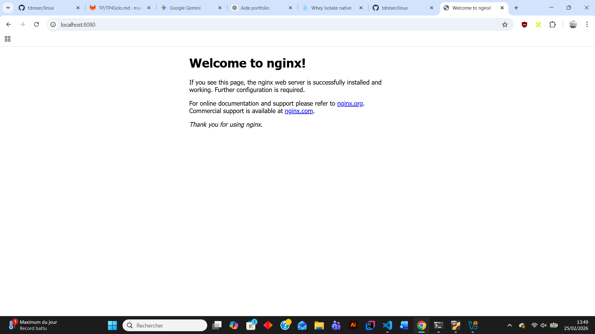
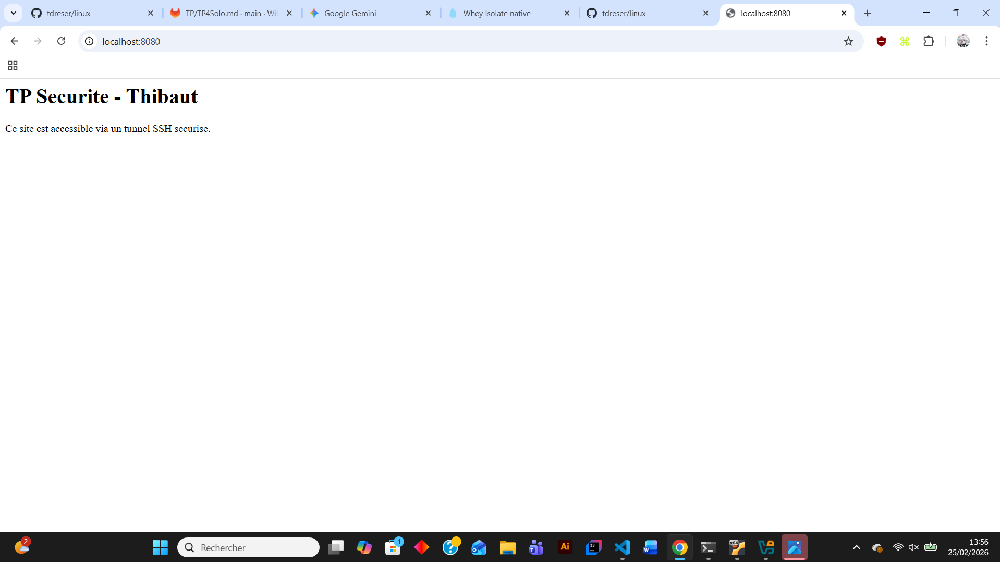
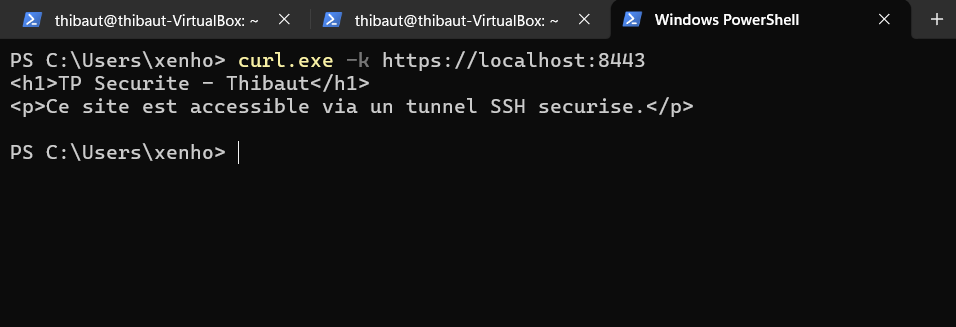
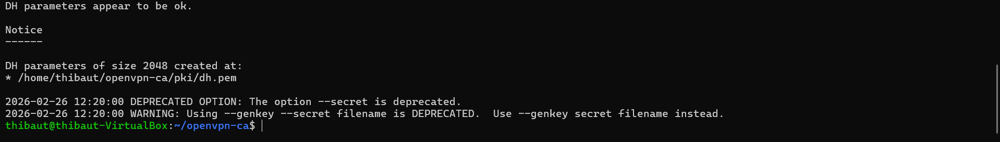
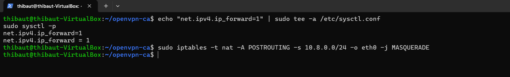
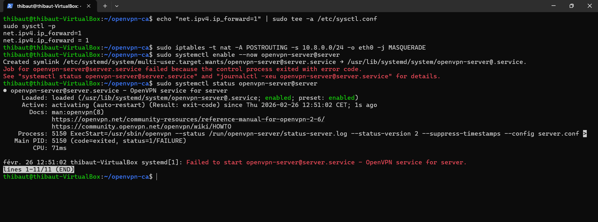
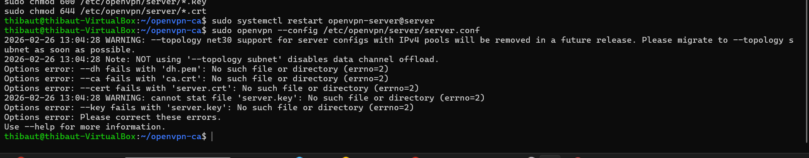
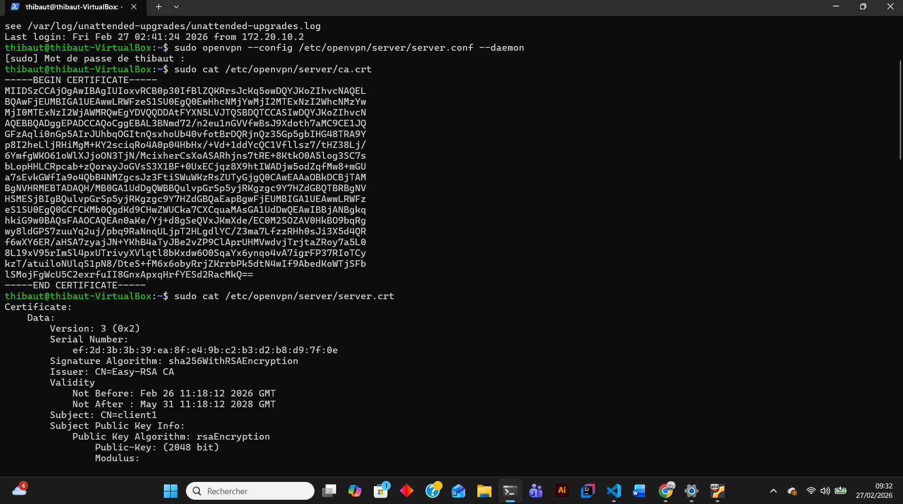
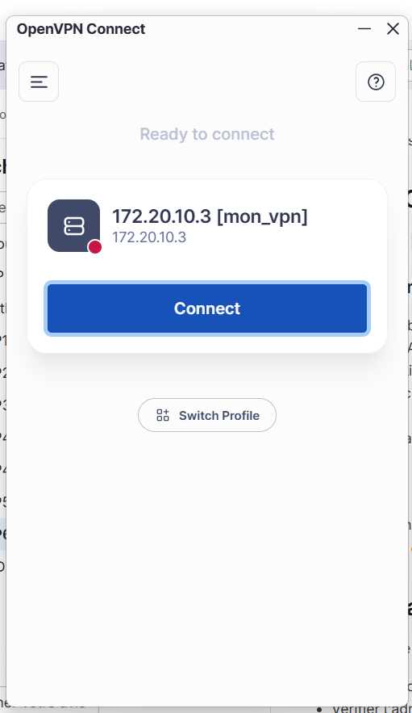
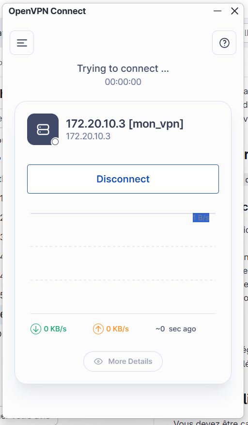

# Cours de Linux

## mon Adresse IP Réseau en Binaire

voici mon adresse IP normale :

### et enfin voici sa version binaire : 

- 00001010.00100001.01000110.11011110

10 → 00001010 en binaire (128 64 32 16 8 4 2 1 → 0 0 0 0 1 0 1 0)

33 → 00100001 en binaire

70 → 01000110 en binaire

222 → 11011110 en binaire

On garde toujours 8 bits par octet, en complétant avec des zéros à gauche si besoin.


# B1 Linux - TP2

## I. Exploration locale en solo
### 1. Affichage d'informations sur la pile TCP/IP locale
####  En ligne de commande : 


### Infos cartes réseau (CLI)

**Commande utilisée :** `ip addr show`

**Interface WiFi :**
- Nom : `wlp3s0`
- Adresse MAC : `00:11:22:33:44:55`
- Adresse IP : `172.16.0.100/20`

**Interface Ethernet :**
- Nom : `enp2s0`
- Adresse MAC : `aa:bb:cc:dd:ee:ff`
- Adresse IP : `Aucune (interface DOWN)`

**Calculs réseau WiFi :**

- commande : ipcalc -n 172.16.0.100/20

Address:   172.16.0.100         10101100.00010000.00000000.01100100
           +---------------------+
Netmask:   255.255.240.0        = 20                           [20 bits]
Wildcard:  0.0.15.255           [12 bits]
Nth-host:  16th-host            = 4096 hosts total
=> Network: 172.16.0.0/20       10101100.00010000.00000000.00000000
    Broadcast: 172.16.15.255    10101100.00010000.00001111.11111111
    => Usable: 172.16.0.1 - 172.16.15.254 (4094 adresses utilisables)

#### En graphique (GUI : Graphical User Interface)


à quoi sert la gateway dans le réseau d'Ingésup ?

- Ma réponse :

La gateway (passerelle) sert de point de sortie pour toutes les requêtes qui ne sont pas destinées au réseau local (LAN). À Ingésup, elle permet à ton ordinateur de communiquer avec des réseaux extérieurs, comme Internet, en acheminant tes paquets de données vers le routeur de l'école.

### 2. Modifications des informations
### A. Modification d'adresse IP - pt. 1

Pour un réseau en 10.33.70.222 avec un masque 255.255.240.0 :


    Adresse de réseau : 10.33.64.0

    Adresse de broadcast : 10.33.79.255 

    Première IP utilisable : 10.33.64.1

    Dernière IP utilisable : 10.33.79.254 


- j'ai ensuite modifié manuellement l'adresse ip de ma carte WIFI : 


### B. nmap

pour cette partie la du tp, la connection de l'école ne fonctionnait plus donc j'ai du me faire un part de co avec mon téléphone , voici donc les informations :

IP Address : 172.20.10.2

Netmask : 255.255.255.240 (soit un /28)

Default Route (Gateway) : 172.20.10.1

Broadcast : 172.20.10.15

- commande : nmap -sn 172.20.10.0/28


### C. Modification d'adresse IP - pt. 2

## II. Exploration locale en duo
### 1. Cablage effectué

### 2. Création du réseau

### 3. Modification d'adresse IP
bien effectuée:


### 4. Utilisation d'un des deux comme gateway

j'ai decidé de prendre Antonin comme duo pour ce TP, ici ce sera lui qui jouera le role de gateway pendant que moi je joue le role du pc qui n'a plus internet.

je peux bien ping antonin :


et voilà bien un ping 8.8.8.8 qui fonctionne sans carte WiFi :


### 5. Petit chat privé
je suis sur linux donc j'ai deja netcat, et la communication depuis le port 8888 est bien effectuée : 


### 6. Wireshark


voici ce qu'il se passe dans mon wireshark quand Antonin me ping : 


voici ce qu'il se passe dans mon wireshark quand Antonin netcat : 


### 7. Firewall


## III. Manipulations d'autres outils/protocoles côté client

## pour cette partie là du TP je suis sur la connection de chez moi

### 1. DHCP
- afficher l'adresse IP du serveur DHCP du réseau WiFi et sa date d'expiration :


L'adresse IP de mon serveur DHCP est 192.168.1.1


et la date d'expiration du bail DHCP est donc le Vendredi 20 février 2026 à 08:50:53.

####  Demandez une nouvelle adresse IP (en ligne de commande)

``` nmcli device reapply wlo1 ```  --> est la commande pour demander une nouvelle adresse IP (en ligne de commande)


### 2. DNS

- voici les lookups et les reverses lookups demandés :


- interpréter les résultats :

L’outil dig a servi à interroger l'annuaire DNS. Les Lookups sur google.com et ynov.com ont traduit ces noms en adresses IP, prouvant que le DNS permet d'éviter de mémoriser des suites de chiffres. On note que Google renvoie plusieurs IPs pour la répartition de charge (Load Balancing). À l'inverse, les Reverse Lookups sur 78.78.21.21 et 92.16.54.88 n'ont rien renvoyé : cela signifie qu'aucun enregistrement PTR (nom associé à l'IP) n'a été configuré pour ces adresses, ce qui est courant pour des IPs de particuliers ou des serveurs sans identité publique.


# B1 Linux - TP3

# Compte rendu – TP3 Cryptographie avec OpenSSL

## A. Base64

### 1. Génation d’un fichier binaire
voici la commande utilisée:
```bash
dd if=/dev/urandom of=data.bin bs=1k count=100
```

- Vérification de la taille avec ls et les paramètres
```
ls -lh data.bin
```
- Le fichier fait 100 Ko

### 2. Encodage Base64
#### Commande
```
openssl base64 -e -in data.bin -out data.b64
```

#### Affichage
On affiche le contenu du fichier
```
cat data.b64
```

- fichier texte illisible mais qui semble structuré

#### Comparaison des tailles
```
ls -lh data.bin data.b64
```

On observe que data.b64 est plus volumineux que data.bin de 36ko

### 3. Décodage
#### Commande
```
openssl base64 -d -in data.b64 -out data_restored.bin
```

Vérification d’intégrité
```
diff -s data.bin data_restored.bin
```

- à priori les fichiers sont identiques "are identical".
```bash
thibaut@thibaut-Victus-by-HP-Gaming-Laptop-15-fa1xxx$ diff -s data.bin data_restored.bin 
Files data.bin and data_restored.bin are identical
```

### 4. Questions

#### 1. Base64 est-il un chiffrement ?
- Non. Base64 est un encodage, pas un chiffrement. Il ne protège pas les données.

#### 2. Pourquoi la taille change ?
- Base64 convertit 3 octets en 4 caractères ASCII, ce qui augmente la taille

#### 3. Pourcentage d’augmentation ?
- Environ 33 %

#### 4. Méthode rigoureuse de vérification ?

La commande diff est une excellente méthode de vérification :
```
diff -s fichier1 fichier2
```

## B. Chiffrement symétrique – AES
### 1. Création du message

Création du fichier :

```
nano confidentiel.txt
```

Contenu :

```
DRESER Thibaut
19/02/2026
Bordeaux
Fichier confidentiel
de 5 lignes
```

### 2. Chiffrement
Commande utilisée: 

openssl enc -aes-256-cbc -salt -pbkdf2 -md sha256 -in confidentiel.txt -out confidentiel.enc


Vérification du type de fichier
```
file confidentiel.enc
```

Résultat :
Le fichier est détecté comme données binaires et ça dit que le fichier est avec protégé avec un mot de passe de salage.

Si on fait :

```cat confidentiel.enc``` --> permet observer des caractères illisibles mais le fichier commence par Salted_

### 3. Déchiffrement
```
openssl enc -d -aes-256-cbc -pbkdf2 -md sha256 -in confidentiel.enc -out confidentiel_dechiffre.txt
```

#### Vérification :

diff -s confidentiel.txt confidentiel_dechiffre.txt

Résultat :
Les fichiers sont identiques

### 4. Analyse – Double chiffrement

On chiffre une seconde fois :

```
openssl enc -aes-256-cbc -salt -pbkdf2 -md sha256 -in confidentiel.txt -out confidentiel2.enc
```

Comparaison :
```
diff confidentiel.enc confidentiel2.enc
```

Résultat :
Les deux fichiers sont différents mais commencent tous les deux par Salted_

### 5. Questions
#### 1. Pourquoi les deux fichiers chiffrés sont différents ?

- Parce qu’un sel aléatoire est généré à chaque chiffrement basé sur un mot d'encryption

#### 2. Quel est le rôle du sel ?

- Il permet de rendre chaque chiffrement unique et il empêche d’identifier deux fichiers identiques chiffrés avec le même mot de passe comme j'ai fait

#### 3. Que se passe-t-il si une option change lors du déchiffrement ?

- Le déchiffrement échoue ou produit un fichier corrompu.
Les paramètres doivent être strictement identiques (algorithme, hash, PBKDF2…).

#### 4. Pourquoi utilise-t-on PBKDF2 ?

- PBKDF2 permet de renforcer la sécurité des mots de passe, il ralentit les attaques par force brute et dérive une clé robuste à partir d’un mot de passe faible comme `admin` que j'ai mis

#### 5. Différence entre encodage et chiffrement ?

- Encodage : transformation réversible sans secret (ex: Base64)

- Chiffrement : transformation nécessitant une clé secrète

## C. Cryptographie asymétrique – RSA
### 1. Génération des clés
Génération de la clé privée protégée
```
openssl genpkey -algorithm RSA -aes-256-cbc -out rsa_private.pem -pkeyopt rsa_keygen_bits:2048
```

Extraction de la clé publique
```
openssl rsa -in rsa_private.pem -pubout -out rsa_public.pem
```
Affichage des paramètres de la clé privée
```
openssl rsa -in rsa_private.pem -text -noout
```

On observe :

Modulus (n)

Public Exponent (e)

Private Exponent (d)

Prime1 (p)

Prime2 (q)

Exponents associés

Coefficient

#### Affichage des paramètres de la clé publique
```
openssl rsa -in rsa_public.pem -pubin -text -noout
```

On observe :

Modulus (n)

Public exponent (e)

#### Comparaison

La clé privée contient tous les paramètres mathématiques nécessaires et la clé publique ne contient que le modulo et l’exposant public.

### 2. Chiffrement asymétrique
Création du fichier
```
nano secret.txt
```

Chiffrement
```
openssl pkeyutl -encrypt -pubin -inkey rsa_public.pem -in secret.txt -out secret.enc
```

Déchiffrement
```
openssl pkeyutl -decrypt -inkey rsa_private.pem -in secret.enc -out secret_dechiffre.txt
```

Vérification :
```
diff -s secret.txt secret_dechiffre.txt
```
Résultat : les fichiers sont identiques
### 3. Questions
#### 1. Pourquoi la clé privée ne doit jamais être partagée ?

- Car elle permet :

- De déchiffrer les messages

- De signer des documents

#### 2. Pourquoi RSA n’est pas adapté aux gros fichiers ?

- Opérations mathématiques lourdes
 
- Taille maximale limitée
 
- Lent comparé à AES

#### 3. Différences clé publique / clé privée ?
Clé publique
- Composition `n + e` et elle est partagée	

Clé privée
- Composition `n + e + d + p + q + autres paramètres` et elle est secrète

#### 4. Rôle du modulo dans RSA ?

- Le modulo (n = p × q) :

-  Base mathématique du système

-  Sa factorisation est extrêmement difficile

- Garantit la sécurité

#### 5. Pourquoi RSA chiffre souvent une clé AES ?

- Parce que :

- AES est rapide pour les gros fichiers

- RSA est utilisé pour sécuriser la clé AES

- C’est le principe du chiffrement hybride (comme TLS)

## D. Signature numérique
### 1. Création et signature
Création
```
nano contrat.txt
```
Empreinte
```
openssl dgst -sha256 contrat.txt
```
Résultat :
```bash
thibaut@thibaut-Victus-by-HP-Gaming-Laptop-15-fa1xxx:~/Documents/linux-b1/TP3$ openssl dgst -sha256 contrat.txt
SHA2-256(contrat.txt)= 181210f8f9c779c26da1d9b2075bde0127302ee0e3fca38c9a83f5b1dd8e5d3b
```
Signature
```
openssl dgst -sha256 -sign rsa_private.pem -out contrat.sig contrat.txt
```
### 2. Vérification
```
openssl dgst -sha256 -verify rsa_public.pem -signature contrat.sig contrat.txt
```

```bash
thibaut@thibaut-Victus-by-HP-Gaming-Laptop-15-fa1xxx:~/Documents/linux-b1/TP3$ openssl dgst -sha256 -verify rsa_public.pem -signature contrat.sig contrat.txt
Verified OK
```
Résultat : Verified OK

Modification du fichier

On ajoute une ligne dans contrat.txt

Nouvelle vérification :
```
openssl dgst -sha256 -verify rsa_public.pem -signature contrat.sig contrat.txt
```

```bash
thibaut@thibaut-Victus-by-HP-Gaming-Laptop-15-fa1xxx:~/Documents/linux-b1/TP3$ openssl dgst -sha256 -verify rsa_public.pem -signature contrat.sig contrat.txt
Verification failure
40A7A4D385700000:error:02000068:rsa routines:ossl_rsa_verify:bad signature:../crypto/rsa/rsa_sign.c:430:
40A7A4D385700000:error:1C880004:Provider routines:rsa_verify:RSA lib:../providers/implementations/signature/rsa_sig.c:774:
```
Résultat : Verification Failure

### 3. Questions
#### 1. Que se passe-t-il après modification ?

- La signature devient invalide et ne marche plus

#### 2. Pourquoi ?

- Parce que le hash du fichier change et que la signature correspond à l’empreinte exacte du fichier original qu'on a créé avant qu'il soit modifié.

#### 3. Rôle du hachage ?

- Réduit le document à une empreinte fixe, rendre la signature rapide et Garantir l’intégrité

#### 4. Différence signature / chiffrement ?
Le Chiffrement :
- Protège la confidentialité, utilise clé publique pour chiffrer

- Déchiffrement avec clé privée

La signature : 
- Garantit authenticité et intégrité, Utilise clé privée pour signer et permet la vérification avec clé publique

# TP 4 solo
## Partie 1 – Mise en place de l’environnement virtualisé

- creation de la VM :


## Partie 2 – Serveur SSH

- Apres avoir installé le serveur ssh sur ma VM, voici une preuve que la connection ssh depuis mon terminal windows fonctionne :


- Générez une clé SSH sur la machine cliente et copiez-la sur le serveur pour tester la connexion sans mot de passe.
Pistes : ssh-keygen, ssh-copy-id :


## Partie 3 – Sécurisation SSH

- désactiver l’accès root l'authentification par mot de passe.

Changez le port par défaut
depuis une interface avec  la commande 
```
sudo nano /etc/ssh/sshd_config
``` 

- Testez la connexion avec le nouveau port depuis la machine cliente.


- voici la validation de la connexion SSH sur le port 2222. L'accès est sécurisé par clé publique (demande de passphrase) et l'accès par mot de passe classique est désormais désactivé dans la configuration du serveur


## Partie 4 – Transfert de fichiers

- SCP : scp fichier.txt serveur-tp:/home/etudiant/


- SFTP : explorez les commandes put, get, ls pour transférer et naviguer sur le serveur.


- RSYNC : synchronisez un dossier entre client et serveur.

- Rsync n'étant pas natif sur l'hôte Windows, j'ai utilisé scp -r pour transférer l'intégralité du dossier Dossier_TP vers le serveur en utilisant l'alias SSH


## Partie 5 – Analyse des logs et sécurité

- Installez Fail2Ban et testez un bannissement après plusieurs tentatives échouées.


comme on peut le voir sur ce screen, on peut voir que je suis bien banni , car le serveur ne repond carrement plus là

ce bannissement a carrément entrainé un crash de ma page du terminal connectée en ssh !

j'ai donc du me déban : 


## partie 6 - Tunnel SSH

- Créez un tunnel local pour accéder à un service web distant depuis la machine cliente.


- Créez un tunnel distant pour permettre l’accès SSH au client via le serveur.


## Partie 7 – Nginx et HTTPS

- Installez Nginx sur la VM.



- Créez un site test dans /var/www/site-tp et un fichier index.html avec un message de bienvenue.



- Testez le site depuis le client :




## Partie 8 – Firewall et permissions


## Partie 9 – Validation finale

Le serveur a été entièrement durci par la mise en place d'un accès SSH sur le port 2222 avec authentification exclusive par clés ED25519, sécurisé par Fail2Ban pour prévenir les intrusions. Le service Web Nginx héberge un site personnalisé dans /var/www/site-tp avec des permissions restrictives (chown www-data / chmod 755) et assure la confidentialité via un certificat SSL auto-signé. La continuité du service est garantie par une redirection automatique HTTP vers HTTPS et l'accès externe est filtré par le pare-feu UFW (Nginx Full), tout en restant administrable à distance via un tunnel SSH local (ports 8080/8443).

# TP5 solo
Compte-rendu de TP : Administration Pare-feu pfSense
Partie 1 – Prise en main et sécurisation
1. Accès à l’interface
Quelle est l’adresse IP du LAN ?

Réponse : 192.168.1.1. C'est l'adresse de passerelle par défaut du réseau local.

Quelle est l’adresse IP du WAN ?

Réponse : C'est l'IP fournie par VirtualBox (ex: 10.0.2.15). Elle permet au pare-feu d'aller sur Internet.

Pourquoi utilise-t-on HTTPS ?

Réponse : Pour chiffrer la communication entre mon PC et pfSense. Cela empêche qu'un pirate ne vole mon mot de passe admin en "écoutant" le réseau.

Pourquoi faut-il changer les identifiants par défaut ?

Réponse : Parce que admin / pfsense est connu de tous. N'importe qui pourrait se connecter et modifier ma sécurité.

Ce que j'ai fait : J'ai ouvert Firefox sur Ubuntu, tapé https://192.168.1.1, ignoré l'alerte de sécurité "Risque potentiel" (certificat auto-signé) et je me suis logué.

2. Sécurisation de l’accès administrateur
Où se gèrent les utilisateurs ?

Réponse : Dans le menu System > User Manager.

Qu’est-ce qu’un mot de passe robuste ?

Réponse : Un mot de passe de plus de 12 caractères avec majuscules, minuscules, chiffres et symboles (ex: P@ssw0rd_pfSense!).

Pourquoi sécuriser en priorité l’accès admin ?

Réponse : Car l'admin a les pleins pouvoirs. S'il est piraté, toute l'infrastructure tombe.

Ce que j'ai fait : Je suis allé dans System > User Manager, j'ai cliqué sur l'icône "crayon" à côté de l'utilisateur admin, j'ai tapé mon nouveau mot de passe et j'ai cliqué sur Save.

Partie 2 – Interfaces réseau
3. Vérification des interfaces
Quelle interface permet l’accès Internet ?

Réponse : L'interface WAN.

Quelle interface correspond au réseau interne ?

Réponse : L'interface LAN.

Que se passerait-il si les interfaces étaient inversées ?

Réponse : On perdrait l'accès à l'interface web (car le WAN bloque tout par défaut) et Internet ne fonctionnerait plus sur le LAN.

Ce que j'ai fait : Je suis allé dans Interfaces > Assignments pour voir quelle carte (em0, em1) était liée au WAN et au LAN.

Partie 3 – Configuration des services réseau
4. DHCP
Pourquoi utiliser DHCP plutôt qu’une IP fixe ?

Réponse : Pour que les ordinateurs reçoivent leur config automatiquement sans erreur manuelle.

Quelle plage d’adresses choisir ?

Réponse : Une plage dans le réseau LAN, par exemple 192.168.1.10 à 192.168.1.100.

Quelles adresses faut-il éviter d’inclure ?

Réponse : L'adresse du pare-feu lui-même (192.168.1.1) et celles des serveurs fixes.

Ce que j'ai fait : Je suis allé dans Services > DHCP Server, j'ai coché "Enable", rempli le champ "Range" (10 à 100) et validé. Sur Ubuntu, j'ai vérifié avec ip a.

5. DNS
Pourquoi un pare-feu peut-il jouer le rôle de DNS ?

Réponse : Pour centraliser les requêtes et filtrer les sites dangereux directement à la racine.

DNS en panne vs Ping 8.8.8.8 fonctionne ?

Réponse : Le réseau marche (IP), mais la traduction des noms (ex: https://www.google.com/url?sa=E&source=gmail&q=google.com) est cassée. On ne peut plus naviguer par nom.

Ce que j'ai fait : Je suis allé dans Services > DNS Resolver, j'ai vérifié qu'il était actif. Sur Ubuntu, j'ai tapé nslookup google.com pour tester.

Partie 4 – Autoriser l’accès Internet
6. Règles de pare-feu
Quelle doit être la source ?

Réponse : LAN net (tout le réseau local).

Quelle doit être la destination ?

Réponse : any (n'importe où sur Internet).

Faut-il autoriser tous les protocoles ?

Réponse : Non, idéalement juste le TCP (ports 80, 443) et le DNS (port 53).

Ce que j'ai fait : Je suis allé dans Firewall > Rules, onglet LAN. J'ai cliqué sur "Add", mis "Action: Pass", "Source: LAN net", "Destination: any", puis j'ai cliqué sur Apply Changes.

7. NAT
Pourquoi le NAT est-il nécessaire ?

Réponse : Pour transformer l'IP privée d'Ubuntu en l'IP WAN du pare-feu, car les IP privées ne peuvent pas circuler sur Internet.

NAT automatique vs Manuel ?

Réponse : L'automatique crée les règles seul. Le manuel permet de choisir précisément quelle machine sort avec quelle IP.

Ce que j'ai fait : Je suis allé dans Firewall > NAT, onglet Outbound pour vérifier que le mode "Automatic" était bien sélectionné.

Partie 5 – Filtrage
8. Blocage d’un site spécifique
Bloquer par IP ou domaine ?

Réponse : Par domaine. Les IP des grands sites changent tout le temps.

Que se passe-t-il en HTTPS ?

Réponse : Le blocage fonctionne toujours car pfSense voit le nom du site dans le paquet de connexion (SNI).

Pourquoi le blocage par IP est contourné ?

Réponse : Car un site peut avoir plusieurs IP ou l'utilisateur peut passer par un VPN.

Ce que j'ai fait : J'ai créé un Alias (Firewall > Aliases) avec l'adresse du site, puis une règle Block tout en haut de ma liste LAN avec cet alias comme destination.

Partie 6 – Aller plus loin
14. DMZ
Qu'est-ce qu'une DMZ ?

Réponse : Une zone isolée pour les serveurs exposés à Internet.

Pourquoi isoler ?

Réponse : Pour que si le serveur web est piraté, le pirate soit coincé là et ne puisse pas entrer dans mon réseau LAN privé.

Ce que j'ai fait : J'ai activé une troisième interface dans VirtualBox, je l'ai nommée DMZ dans pfSense et j'ai créé des règles pour interdire le trafic de la DMZ vers le LAN.

17. Sauvegarde / Restauration
Pourquoi est-ce essentiel ?

Réponse : Pour remettre le réseau en route en 2 minutes si le pare-feu tombe en panne ou si on fait une bêtise dans les réglages.

Ce que j'ai fait : Je suis allé dans Diagnostics > Backup & Restore, j'ai cliqué sur "Download configuration as XML".

# TP -- Mise en place d'un serveur OpenVPN sur Ubuntu Server

## Partie 1 : Comprendre la PKI

- À quoi sert une autorité de certification (CA) ?

C'est le tiers de confiance. Elle sert à signer et valider les certificats des clients et du serveur. Si un certificat n'est pas signé par la CA, la connexion est refusée. C'est elle qui garantit que l'interlocuteur est bien celui qu'il prétend être.

- Quelle différence entre clé privée et certificat ?

Clé privée (.key) : Elle est secrète. Elle sert à déchiffrer les données et à prouver son identité. Elle ne doit jamais sortir de la machine.

Certificat (.crt) : Il est public. Il contient la clé publique et l'identité de l'utilisateur. Il est transmis à l'autre pour qu'il puisse chiffrer les données vers vous.

- Pourquoi un serveur VPN a-t-il besoin de certificats ?

Pour assurer l'authentification mutuelle sans simple mot de passe. Cela permet au serveur de vérifier que le client est autorisé et au client d'être sûr qu'il se connecte au bon serveur (évite les attaques "Man-in-the-middle"). Les certificats servent aussi à établir la clé de chiffrement du tunnel.

### Création de l'infrastructure Easy-RSA

- Créer un environnement PKI avec : 
Une CA
Un certificat serveur
Un certificat client
Les paramètres Diffie-Hellman
Une clé TLS supplémentaire



- Où Easy-RSA crée-t-il ses fichiers ?

Dans le répertoire ~/openvpn-ca/pki/ sur ta VM.

- Que contient le dossier pki/ ?

La CA (ca.crt), les clés privées (dossier private/), les certificats signés (dossier issued/) et les fichiers de sécurité comme le DH.

- Quelle est la différence entre gen-req et sign-req ?

gen-req génère une demande d'identité (non certifiée). sign-req est l'approbation de cette demande par la CA pour créer le certificat officiel.

- Que se passe-t-il si vous oubliez de signer un certificat ?

Le fichier .crt n'est pas généré et le serveur OpenVPN rejettera la connexion car l'identité ne pourra pas être vérifiée.

## Partie 2 : Configuration du serveur OpenVPN

- Créer un fichier de configuration serveur.
/etc/openvpn/server/server.conf avec les elements suivants : 


- Que signifie dev tun ?

C'est une interface réseau virtuelle de type Tunnel (couche 3 / IP). Elle permet de router uniquement des paquets IP, ce qui est plus léger et performant pour un VPN.

- Quelle différence entre UDP et TCP pour un VPN ?

UDP (recommandé) est plus rapide car il n'attend pas d'accusé de réception des paquets. TCP est plus lent mais plus fiable dans les environnements où le réseau est très instable ou censuré.

- Quelle plage IP choisir pour le VPN ? Pourquoi ?

Une plage privée (ex: 10.8.0.0/24). On la choisit pour éviter tout conflit avec le réseau local physique de l'utilisateur et pour isoler le trafic VPN du reste d'Internet.

## Routage et NAT

- Activer le forwarding (Routage au niveau du noyau)

- Mettre en place une règle NAT pour avoir l'accès internet depuis le vpn



- pour vérifier que c'est fonctionnel : 

- Où se configure le paramètre ip_forward ?

Dans le fichier /etc/sysctl.conf.

- Quelle commande permet d'afficher les règles NAT actuelles ?

sudo iptables -t nat -L -n -v.

- Pourquoi faut-il "masquerader" le réseau VPN ?

Pour que le serveur remplace l'IP privée du client (non reconnue sur Internet) par sa propre IP publique afin de permettre la navigation web.


## Démarrage et analyse du service

- malheureusement , j'ai eu des problemes lors de la réalisation de ces étapes :  
>Démarrer le service OpenVPN

>Vérifier son état



- je dois donc rentrer dans cette condition : 
### Si le service échoue :

- Quelle commande permet d'afficher les logs système d'un service ?

La commande est : sudo journalctl -u openvpn-server@server.
(On ajoute souvent -n 50 pour voir les 50 dernières lignes ou -f pour voir les logs arriver en direct).

- Quelle est la différence entre status et journalctl ?

systemctl status : Donne un résumé rapide de l'état du service (est-il lancé, depuis quand, quel est son PID) et les 10 dernières lignes de logs.

journalctl : C'est l'outil de consultation de l'ensemble des journaux du système. Il permet de voir tout l'historique des erreurs, même anciennes, de façon très détaillée.

- Les chemins vers les certificats sont-ils corrects ?

Dans ton cas, non, c'est probablement là qu'est l'erreur. Ton fichier server.conf cherche les fichiers dans /etc/openvpn/server/, mais tes certificats sont restés dans ton dossier personnel ~/openvpn-ca/pki/.

- Pourquoi ça n'allait pas ?

Erreur constatée : cp: impossible d'évaluer ... server.crt.

Cause : Lors de la phase PKI (Partie 1), le certificat a été généré sous le nom client1 au lieu de server.

Solution de diagnostic : L'utilisation de ls dans les répertoires de la PKI a permis de voir que le fichier attendu par la configuration n'existait pas sous ce nom.


## Partie 3 : Création du profil client

- Pour le CA :
sudo cat /etc/openvpn/server/ca.crt

- Pour le Certificat :
sudo cat /etc/openvpn/server/server.crt

- Pour la Clé Privée :
sudo cat /etc/openvpn/server/server.key

- Pour la Clé TLS-Auth :
sudo cat /etc/openvpn/server/ta.key

    

- apres avoir rempli mon dossier ovpn avec les informations demandées, et avoir changé son extension en .ovpn, j'ai bien un visuel du vpn dans l'application Openvpn:



