# Cours de Linux

## mon Adresse IP Réseau en Binaire

voici mon adresse IP normale :

### et enfin voici sa version binaire : 

- 00001010.00100001.01000110.11011110

10 → 00001010 en binaire (128 64 32 16 8 4 2 1 → 0 0 0 0 1 0 1 0)

33 → 00100001 en binaire

70 → 01000110 en binaire

222 → 11011110 en binaire

On garde toujours 8 bits par octet, en complétant avec des zéros à gauche si besoin.


# B1 Linux - TP2

## I. Exploration locale en solo
### 1. Affichage d'informations sur la pile TCP/IP locale
####  En ligne de commande : 


### Infos cartes réseau (CLI)

**Commande utilisée :** `ip addr show`

**Interface WiFi :**
- Nom : `wlp3s0`
- Adresse MAC : `00:11:22:33:44:55`
- Adresse IP : `172.16.0.100/20`

**Interface Ethernet :**
- Nom : `enp2s0`
- Adresse MAC : `aa:bb:cc:dd:ee:ff`
- Adresse IP : `Aucune (interface DOWN)`

**Calculs réseau WiFi :**

- commande : ipcalc -n 172.16.0.100/20

Address:   172.16.0.100         10101100.00010000.00000000.01100100
           +---------------------+
Netmask:   255.255.240.0        = 20                           [20 bits]
Wildcard:  0.0.15.255           [12 bits]
Nth-host:  16th-host            = 4096 hosts total
=> Network: 172.16.0.0/20       10101100.00010000.00000000.00000000
    Broadcast: 172.16.15.255    10101100.00010000.00001111.11111111
    => Usable: 172.16.0.1 - 172.16.15.254 (4094 adresses utilisables)

#### En graphique (GUI : Graphical User Interface)


à quoi sert la gateway dans le réseau d'Ingésup ?

- Ma réponse :

La gateway (passerelle) sert de point de sortie pour toutes les requêtes qui ne sont pas destinées au réseau local (LAN). À Ingésup, elle permet à ton ordinateur de communiquer avec des réseaux extérieurs, comme Internet, en acheminant tes paquets de données vers le routeur de l'école.

### 2. Modifications des informations
### A. Modification d'adresse IP - pt. 1

Pour un réseau en 10.33.70.222 avec un masque 255.255.240.0 :


    Adresse de réseau : 10.33.64.0

    Adresse de broadcast : 10.33.79.255 

    Première IP utilisable : 10.33.64.1

    Dernière IP utilisable : 10.33.79.254 


- j'ai ensuite modifié manuellement l'adresse ip de ma carte WIFI : 


### B. nmap

pour cette partie la du tp, la connection de l'école ne fonctionnait plus donc j'ai du me faire un part de co avec mon téléphone , voici donc les informations :

IP Address : 172.20.10.2

Netmask : 255.255.255.240 (soit un /28)

Default Route (Gateway) : 172.20.10.1

Broadcast : 172.20.10.15

- commande : nmap -sn 172.20.10.0/28


### C. Modification d'adresse IP - pt. 2

## II. Exploration locale en duo
### 1. Cablage effectué

### 2. Création du réseau

### 3. Modification d'adresse IP
bien effectuée:


### 4. Utilisation d'un des deux comme gateway

j'ai decidé de prendre Antonin comme duo pour ce TP, ici ce sera lui qui jouera le role de gateway pendant que moi je joue le role du pc qui n'a plus internet.

je peux bien ping antonin :

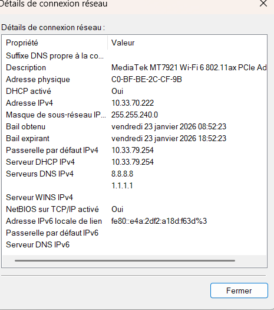

et voilà bien un ping 8.8.8.8 qui fonctionne sans carte WiFi :


### 5. Petit chat privé
je suis sur linux donc j'ai deja netcat, et la communication depuis le port 8888 est bien effectuée : 

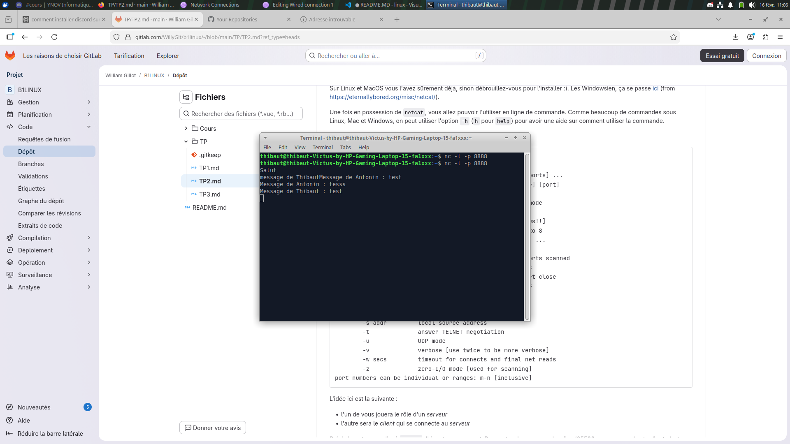

### 6. Wireshark


voici ce qu'il se passe dans mon wireshark quand Antonin me ping : 


voici ce qu'il se passe dans mon wireshark quand Antonin netcat : 


### 7. Firewall


## III. Manipulations d'autres outils/protocoles côté client

## pour cette partie là du TP je suis sur la connection de chez moi

### 1. DHCP
- afficher l'adresse IP du serveur DHCP du réseau WiFi et sa date d'expiration :


L'adresse IP de mon serveur DHCP est 192.168.1.1


et la date d'expiration du bail DHCP est donc le Vendredi 20 février 2026 à 08:50:53.

####  Demandez une nouvelle adresse IP (en ligne de commande)

``` nmcli device reapply wlo1 ```  --> est la commande pour demander une nouvelle adresse IP (en ligne de commande)


### 2. DNS

- voici les lookups et les reverses lookups demandés :


- interpréter les résultats :

L’outil dig a servi à interroger l'annuaire DNS. Les Lookups sur google.com et ynov.com ont traduit ces noms en adresses IP, prouvant que le DNS permet d'éviter de mémoriser des suites de chiffres. On note que Google renvoie plusieurs IPs pour la répartition de charge (Load Balancing). À l'inverse, les Reverse Lookups sur 78.78.21.21 et 92.16.54.88 n'ont rien renvoyé : cela signifie qu'aucun enregistrement PTR (nom associé à l'IP) n'a été configuré pour ces adresses, ce qui est courant pour des IPs de particuliers ou des serveurs sans identité publique.


# B1 Linux - TP3

# Compte rendu – TP3 Cryptographie avec OpenSSL

## A. Base64

### 1. Génation d’un fichier binaire
voici la commande utilisée:
```bash
dd if=/dev/urandom of=data.bin bs=1k count=100
```

- Vérification de la taille avec ls et les paramètres
```
ls -lh data.bin
```
- Le fichier fait 100 Ko

### 2. Encodage Base64
#### Commande
```
openssl base64 -e -in data.bin -out data.b64
```

#### Affichage
On affiche le contenu du fichier
```
cat data.b64
```

- fichier texte illisible mais qui semble structuré

#### Comparaison des tailles
```
ls -lh data.bin data.b64
```

On observe que data.b64 est plus volumineux que data.bin de 36ko

### 3. Décodage
#### Commande
```
openssl base64 -d -in data.b64 -out data_restored.bin
```

Vérification d’intégrité
```
diff -s data.bin data_restored.bin
```

- à priori les fichiers sont identiques "are identical".
```bash
thibaut@thibaut-Victus-by-HP-Gaming-Laptop-15-fa1xxx$ diff -s data.bin data_restored.bin 
Files data.bin and data_restored.bin are identical
```

### 4. Questions

#### 1. Base64 est-il un chiffrement ?
- Non. Base64 est un encodage, pas un chiffrement. Il ne protège pas les données.

#### 2. Pourquoi la taille change ?
- Base64 convertit 3 octets en 4 caractères ASCII, ce qui augmente la taille

#### 3. Pourcentage d’augmentation ?
- Environ 33 %

#### 4. Méthode rigoureuse de vérification ?

La commande diff est une excellente méthode de vérification :
```
diff -s fichier1 fichier2
```

## B. Chiffrement symétrique – AES
### 1. Création du message

Création du fichier :

```
nano confidentiel.txt
```

Contenu :

```
DRESER Thibaut
19/02/2026
Bordeaux
Fichier confidentiel
de 5 lignes
```

### 2. Chiffrement
Commande utilisée: 

openssl enc -aes-256-cbc -salt -pbkdf2 -md sha256 -in confidentiel.txt -out confidentiel.enc


Vérification du type de fichier
```
file confidentiel.enc
```

Résultat :
Le fichier est détecté comme données binaires et ça dit que le fichier est avec protégé avec un mot de passe de salage.

Si on fait :

```cat confidentiel.enc``` --> permet observer des caractères illisibles mais le fichier commence par Salted_

### 3. Déchiffrement
```
openssl enc -d -aes-256-cbc -pbkdf2 -md sha256 -in confidentiel.enc -out confidentiel_dechiffre.txt
```

#### Vérification :

diff -s confidentiel.txt confidentiel_dechiffre.txt

Résultat :
Les fichiers sont identiques

### 4. Analyse – Double chiffrement

On chiffre une seconde fois :

```
openssl enc -aes-256-cbc -salt -pbkdf2 -md sha256 -in confidentiel.txt -out confidentiel2.enc
```

Comparaison :
```
diff confidentiel.enc confidentiel2.enc
```

Résultat :
Les deux fichiers sont différents mais commencent tous les deux par Salted_

### 5. Questions
#### 1. Pourquoi les deux fichiers chiffrés sont différents ?

- Parce qu’un sel aléatoire est généré à chaque chiffrement basé sur un mot d'encryption

#### 2. Quel est le rôle du sel ?

- Il permet de rendre chaque chiffrement unique et il empêche d’identifier deux fichiers identiques chiffrés avec le même mot de passe comme j'ai fait

#### 3. Que se passe-t-il si une option change lors du déchiffrement ?

- Le déchiffrement échoue ou produit un fichier corrompu.
Les paramètres doivent être strictement identiques (algorithme, hash, PBKDF2…).

#### 4. Pourquoi utilise-t-on PBKDF2 ?

- PBKDF2 permet de renforcer la sécurité des mots de passe, il ralentit les attaques par force brute et dérive une clé robuste à partir d’un mot de passe faible comme `admin` que j'ai mis

#### 5. Différence entre encodage et chiffrement ?

- Encodage : transformation réversible sans secret (ex: Base64)

- Chiffrement : transformation nécessitant une clé secrète

## C. Cryptographie asymétrique – RSA
### 1. Génération des clés
Génération de la clé privée protégée
```
openssl genpkey -algorithm RSA -aes-256-cbc -out rsa_private.pem -pkeyopt rsa_keygen_bits:2048
```

Extraction de la clé publique
```
openssl rsa -in rsa_private.pem -pubout -out rsa_public.pem
```
Affichage des paramètres de la clé privée
```
openssl rsa -in rsa_private.pem -text -noout
```

On observe :

Modulus (n)

Public Exponent (e)

Private Exponent (d)

Prime1 (p)

Prime2 (q)

Exponents associés

Coefficient

#### Affichage des paramètres de la clé publique
```
openssl rsa -in rsa_public.pem -pubin -text -noout
```

On observe :

Modulus (n)

Public exponent (e)

#### Comparaison

La clé privée contient tous les paramètres mathématiques nécessaires et la clé publique ne contient que le modulo et l’exposant public.

### 2. Chiffrement asymétrique
Création du fichier
```
nano secret.txt
```

Chiffrement
```
openssl pkeyutl -encrypt -pubin -inkey rsa_public.pem -in secret.txt -out secret.enc
```

Déchiffrement
```
openssl pkeyutl -decrypt -inkey rsa_private.pem -in secret.enc -out secret_dechiffre.txt
```

Vérification :
```
diff -s secret.txt secret_dechiffre.txt
```
Résultat : les fichiers sont identiques
### 3. Questions
#### 1. Pourquoi la clé privée ne doit jamais être partagée ?

- Car elle permet :

- De déchiffrer les messages

- De signer des documents

#### 2. Pourquoi RSA n’est pas adapté aux gros fichiers ?

- Opérations mathématiques lourdes
 
- Taille maximale limitée
 
- Lent comparé à AES

#### 3. Différences clé publique / clé privée ?
Clé publique
- Composition `n + e` et elle est partagée	

Clé privée
- Composition `n + e + d + p + q + autres paramètres` et elle est secrète

#### 4. Rôle du modulo dans RSA ?

- Le modulo (n = p × q) :

-  Base mathématique du système

-  Sa factorisation est extrêmement difficile

- Garantit la sécurité

#### 5. Pourquoi RSA chiffre souvent une clé AES ?

- Parce que :

- AES est rapide pour les gros fichiers

- RSA est utilisé pour sécuriser la clé AES

- C’est le principe du chiffrement hybride (comme TLS)

## D. Signature numérique
### 1. Création et signature
Création
```
nano contrat.txt
```
Empreinte
```
openssl dgst -sha256 contrat.txt
```
Résultat :
```bash
thibaut@thibaut-Victus-by-HP-Gaming-Laptop-15-fa1xxx:~/Documents/linux-b1/TP3$ openssl dgst -sha256 contrat.txt
SHA2-256(contrat.txt)= 181210f8f9c779c26da1d9b2075bde0127302ee0e3fca38c9a83f5b1dd8e5d3b
```
Signature
```
openssl dgst -sha256 -sign rsa_private.pem -out contrat.sig contrat.txt
```
### 2. Vérification
```
openssl dgst -sha256 -verify rsa_public.pem -signature contrat.sig contrat.txt
```

```bash
thibaut@thibaut-Victus-by-HP-Gaming-Laptop-15-fa1xxx:~/Documents/linux-b1/TP3$ openssl dgst -sha256 -verify rsa_public.pem -signature contrat.sig contrat.txt
Verified OK
```
Résultat : Verified OK

Modification du fichier

On ajoute une ligne dans contrat.txt

Nouvelle vérification :
```
openssl dgst -sha256 -verify rsa_public.pem -signature contrat.sig contrat.txt
```

```bash
thibaut@thibaut-Victus-by-HP-Gaming-Laptop-15-fa1xxx:~/Documents/linux-b1/TP3$ openssl dgst -sha256 -verify rsa_public.pem -signature contrat.sig contrat.txt
Verification failure
40A7A4D385700000:error:02000068:rsa routines:ossl_rsa_verify:bad signature:../crypto/rsa/rsa_sign.c:430:
40A7A4D385700000:error:1C880004:Provider routines:rsa_verify:RSA lib:../providers/implementations/signature/rsa_sig.c:774:
```
Résultat : Verification Failure

### 3. Questions
#### 1. Que se passe-t-il après modification ?

- La signature devient invalide et ne marche plus

#### 2. Pourquoi ?

- Parce que le hash du fichier change et que la signature correspond à l’empreinte exacte du fichier original qu'on a créé avant qu'il soit modifié.

#### 3. Rôle du hachage ?

- Réduit le document à une empreinte fixe, rendre la signature rapide et Garantir l’intégrité

#### 4. Différence signature / chiffrement ?
Le Chiffrement :
- Protège la confidentialité, utilise clé publique pour chiffrer

- Déchiffrement avec clé privée

La signature : 
- Garantit authenticité et intégrité, Utilise clé privée pour signer et permet la vérification avec clé publique

# TP 4 solo
## Partie 1 – Mise en place de l’environnement virtualisé

- creation de la VM :
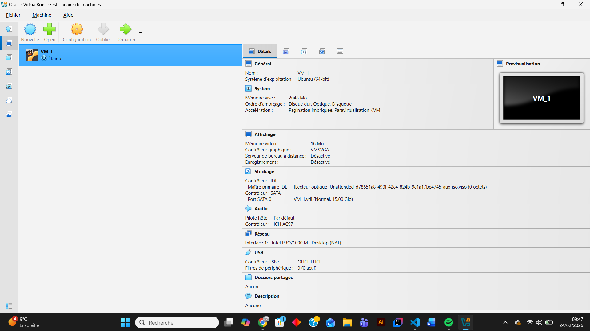

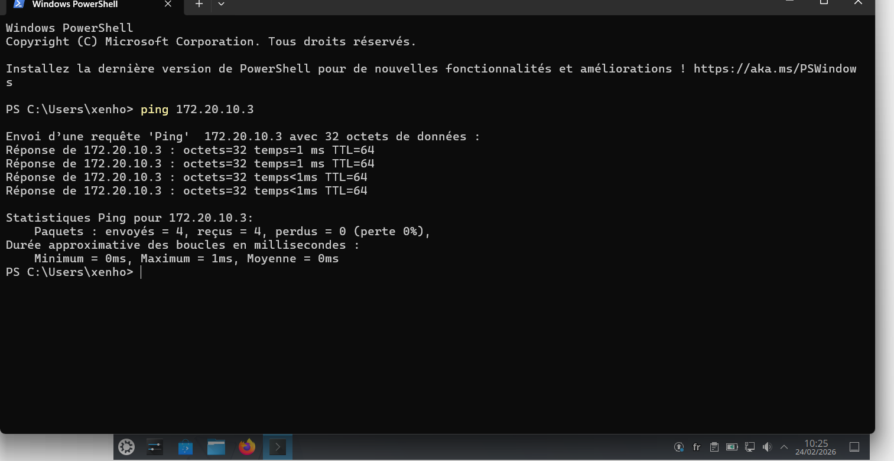

## Partie 2 – Serveur SSH

- Apres avoir installé le serveur ssh sur ma VM, voici une preuve que la connection ssh depuis mon terminal windows fonctionne :

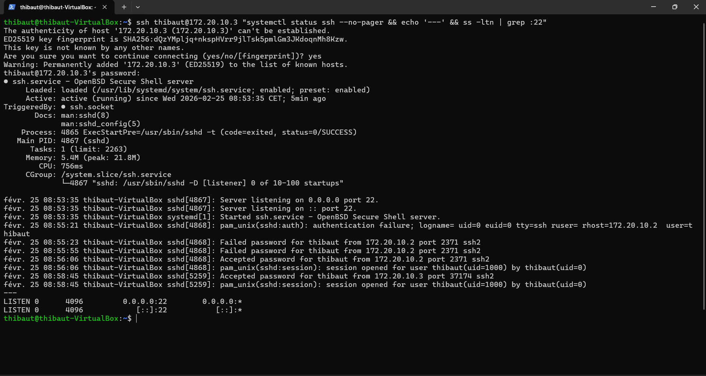

- Générez une clé SSH sur la machine cliente et copiez-la sur le serveur pour tester la connexion sans mot de passe.
Pistes : ssh-keygen, ssh-copy-id :

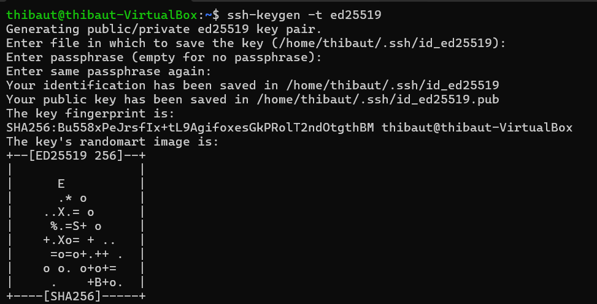
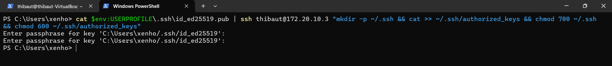

## Partie 3 – Sécurisation SSH

- désactiver l’accès root l'authentification par mot de passe.

Changez le port par défaut
depuis une interface avec  la commande 
```
sudo nano /etc/ssh/sshd_config
``` 

- Testez la connexion avec le nouveau port depuis la machine cliente.

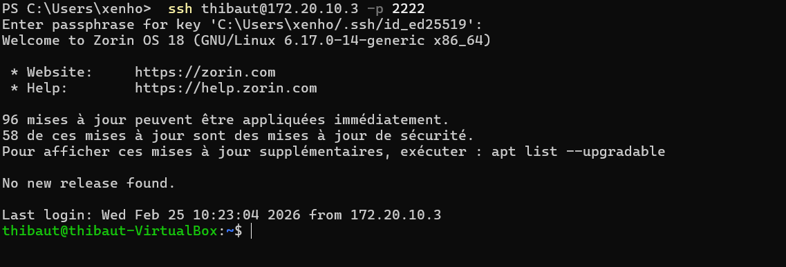
- voici la validation de la connexion SSH sur le port 2222. L'accès est sécurisé par clé publique (demande de passphrase) et l'accès par mot de passe classique est désormais désactivé dans la configuration du serveur

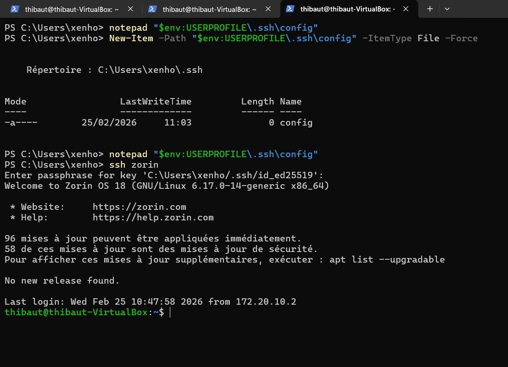

## Partie 4 – Transfert de fichiers

- SCP : scp fichier.txt serveur-tp:/home/etudiant/

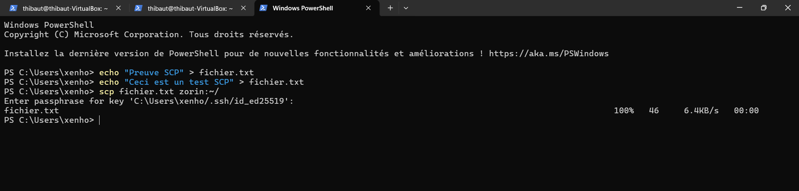

- SFTP : explorez les commandes put, get, ls pour transférer et naviguer sur le serveur.
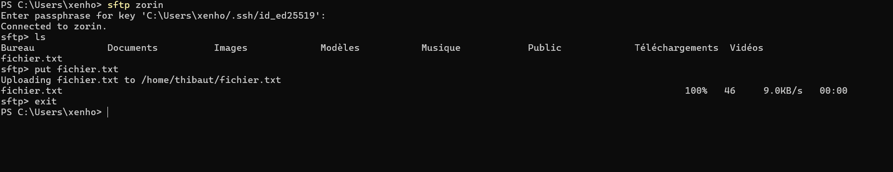

- RSYNC : synchronisez un dossier entre client et serveur.

- Rsync n'étant pas natif sur l'hôte Windows, j'ai utilisé scp -r pour transférer l'intégralité du dossier Dossier_TP vers le serveur en utilisant l'alias SSH

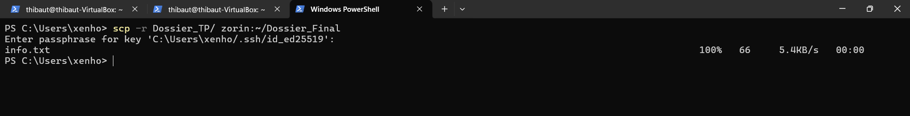

## Partie 5 – Analyse des logs et sécurité

- Installez Fail2Ban et testez un bannissement après plusieurs tentatives échouées.

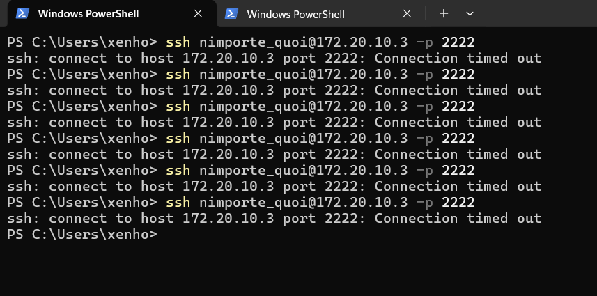

comme on peut le voir sur ce screen, on peut voir que je suis bien banni , car le serveur ne repond carrement plus là

ce bannissement a carrément entrainé un crash de ma page du terminal connectée en ssh !

j'ai donc du me déban : 

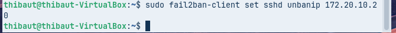

## partie 6 - Tunnel SSH

- Créez un tunnel local pour accéder à un service web distant depuis la machine cliente.


- Créez un tunnel distant pour permettre l’accès SSH au client via le serveur.

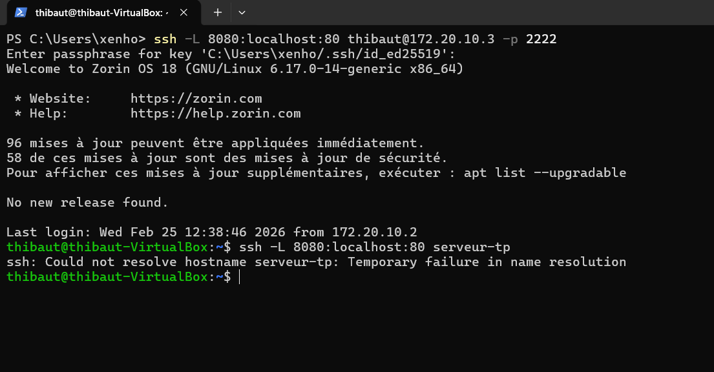

## Partie 7 – Nginx et HTTPS

- Installez Nginx sur la VM.


- Créez un site test dans /var/www/site-tp et un fichier index.html avec un message de bienvenue.


- Testez le site depuis le client :


## Partie 8 – Firewall et permissions

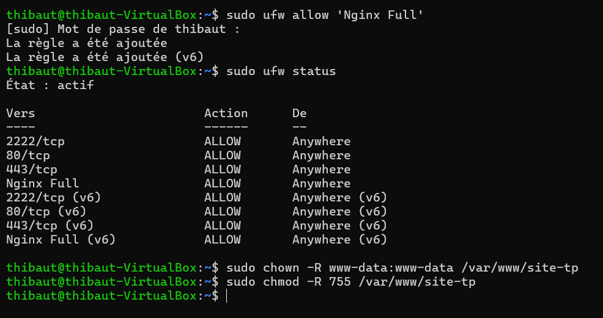

## Partie 9 – Validation finale
